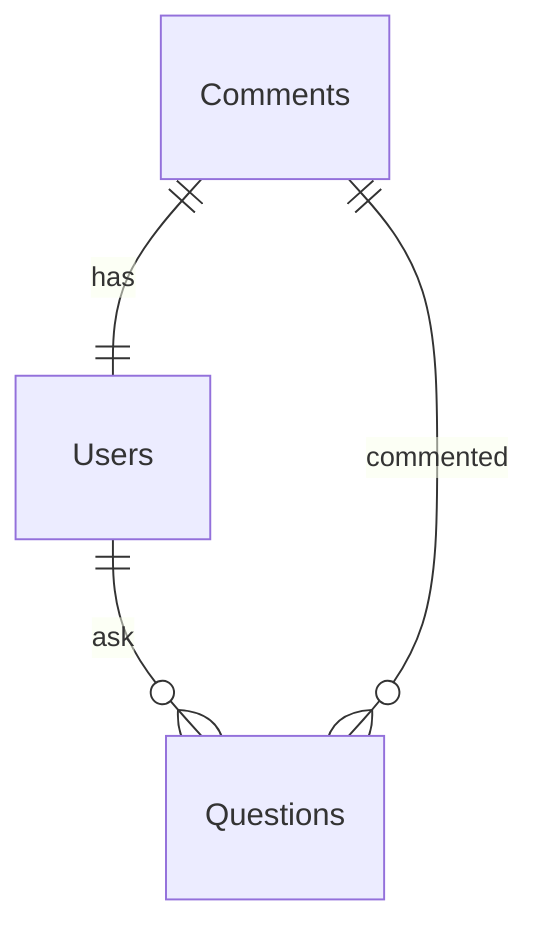

## Entity Relationship Diagram

### Users

| Name | Type | Description |
| --- | --- | --- |
| ID | INT | Primary Key |
| Username | VARCHAR(255) | 유저 ID |
| Password | VARCHAR(512) | 유저 비밀번호 (sha256) |
| DisplayName | VARCHAR(64) | 서비스에 노출될 이름 (= 별칭) |
| CreatedAt | DATETIME | 데이터 생성일 |
| UpdatedAt | DATETIME | 데이터 변경일 |

### Questions

| Name | Type | Description |
| --- | --- | --- |
| ID | INT | Primary Key |
| UserID | INT | 유저의 고유 ID | 
| Question | TEXT | AI에게 한 질문 |
| Answer | TEXT | AI에게서 받은 질문 |
| CreatedAt | DATETIME | 데이터 생성일 |
| UpdatedAt | DATETIME | 데이터 변경일 |

### Comments

코멘트는 단순히 노트 테이킹 하는 용도의 테이블이다.

| Name | Type | Description |
| --- | --- | --- |
| ID | INT | Primary Key |
| UserID | INT | 유저의 고유 ID |
| QuestionID | INT | 질문의 고유 ID |
| Comment | TEXT | 댓글 코멘트 |
| CreatedAt | DATETIME | 데이터 생성일 |
| UpdatedAt | DATETIME | 데이터 변경일 |

### 혼자 주저리 주저리

  
FullText 인덱스를 걸어서 검색 기능을 추가하면 어떨까?

  되는거 맞으려나 ㅎㅎ

  
댓글에 대댓글 기능을 추가하려면 일반적으로는 어떻게 할까?

  ParentID를 추가해서 데이터를 트리 구조로 만들까? 그러면 데이터를 어떻게 가져오지? 매번 재귀로 SQL 날려서 가져오면 비효율적일텐데

  [다들 그렇게 하네? 조금 오래전 글이긴 하지만..](https://stackoverflow.com/questions/1260878/mysql-structure-for-comments-and-comment-replies)

